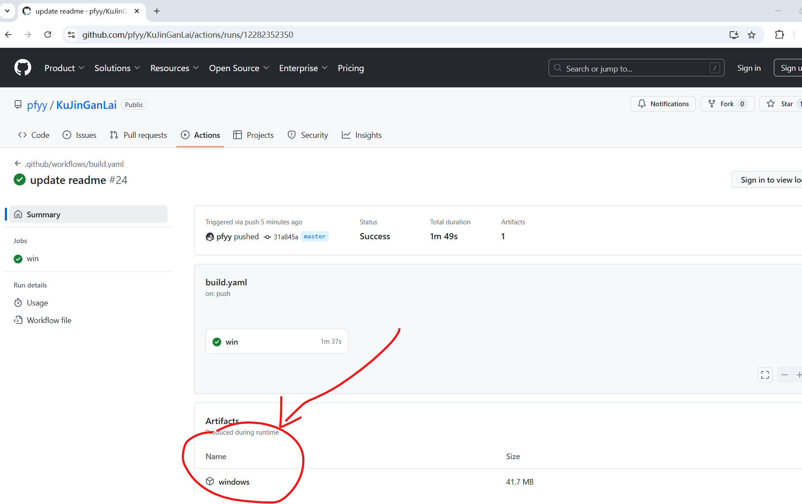
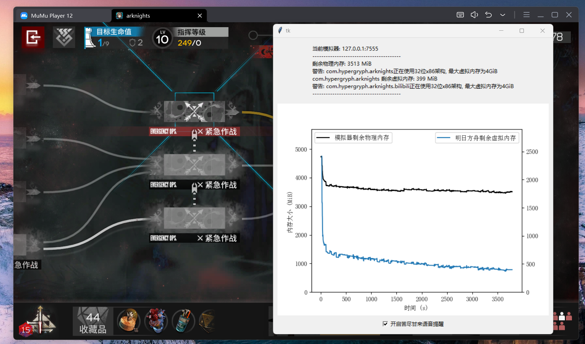
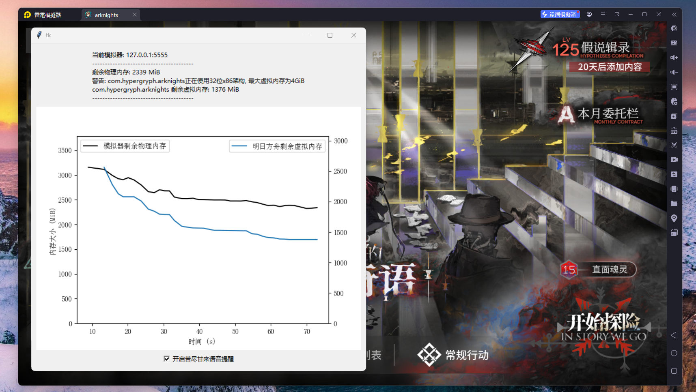
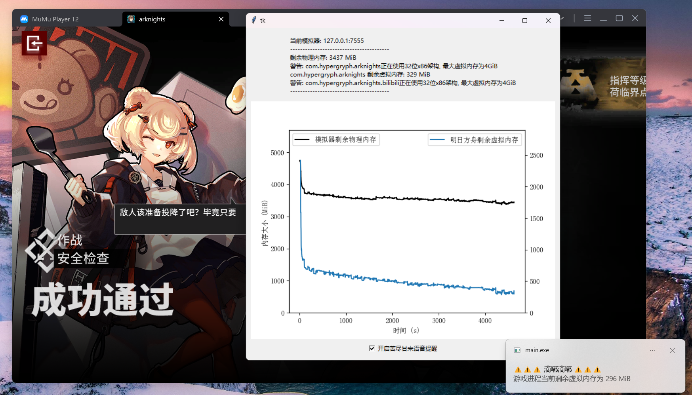

# 明日方舟苦尽甘来警报器

## 背景介绍

众所周知 (?), 明日方舟有着较为严重的内存泄露问题. 长时间游玩时 (即经典蓝图死仇萨卡兹肉鸽, 3h+的游玩时长), 游戏便会因为虚拟地址空间 (对于32位架构的x86而言, 虚拟地址空间仅为4GiB) / 物理内存空间耗竭, 导致内存分配相关调用返回`nullptr`, 进而导致游戏闪退. 该问题很容易被解读为MUMU模拟器自身的优化问题. 但实际上, 在LD模拟器乃至手机上, 闪退也是经常发生的事情 (b站搜索: 明日方舟 + 闪退, 时间排序), 只是由于使用MUMU玩明日方舟的人实在太多, MUMU 的市场占有率太高, 导致了大家只会先想到 MUMU, 让 MUMU 成为了经典背锅侠.

> 看不懂, 反正都怪AMD

> 你的键盘上有A, M, D三个字母导致的

## 项目说明

本项目检测模拟器中明日方舟的内存占用, 并将内存占用随时间的变化情况绘制为曲线图 (内存泄漏, 铁证如山), 并在模拟器物理内存/游戏进程虚拟内存耗竭前发送通知, 避免苦尽甘来.

> 本项目支持在发送通知时播放音频, 特别感谢血狼破军先生为开源项目做出的贡献.

本项目支持官服和B服. 我没有B服的账号, 因而B服没有进行过深入的测试, 但理论上本项目在B服客户端上不应当存在任何兼容性问题.

明日方舟的内存耗竭导致的闪退很好复现, 您只需经典公式ew蓝图死仇萨卡兹肉鸽, 1/2 + 3结局连打, 让游玩时间尽可能长 (经典3h垃圾时间), 即可稳定触发闪退.

## 使用方法

### 给程序员看的使用方法

1. 开启模拟器的adb连接. 支持的模拟器: MUMU, LD

2. `pip install -r requirements.txt`; 执行`main.py` (或者执行github action生成的二进制main.exe)

3. 在游戏运行过程中, 保持本工具的开启. 本工具将自动周期获取模拟器的内存使用情况. 当内存不足时, 本工具使用windows的通知给出警告.

### 给一般用户的使用方法

1. 开启模拟器的adb连接. 支持的模拟器: MUMU, LD

> 如果你用过MAA, 那你应该无需执行本操作

2. 在 [https://github.com/pfyy/KuJinGanLai/actions](https://github.com/pfyy/KuJinGanLai/actions) 页面下载最新的workflow产物 (文件名应为`windows.zip`)

3. 解压, 运行 `main.exe`.

4. 在游戏运行过程中, 保持本工具的开启.

## 截图

mumu模拟器中游玩肉鸽时的截图, 肉眼可见的内存泄漏:

ld模拟器, 我不常用, 所以只放了一个进入肉鸽界面后的内存占用图:

当物理内存/虚拟内存不足时, 程序将自动触发警告, 提示用户重启游戏. 警告示意图 (实际警戒线为 300 MiB):

